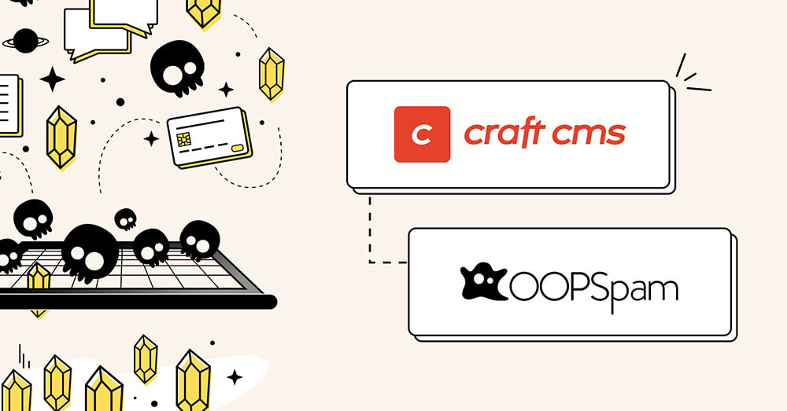

# OOPSpam Anti-Spam for Craft CMS

A privacy friendly anti-spam utility to safeguard your website and customers.

## Requirements

This plugin requires Craft CMS 4.0.0 or later.

## Installation

`composer require cloudgrayau/oopspam`

## OOPSpam Overview

OOPSpam is a privacy friendly anti-spam utility for protecting forms, user registrations, commerce and comments in Craft CMS.

OOPSpam is a modern spam filter that uses machine learning to analyse messages, checking each submission against an extensive database of over 500 million IPs and emails to effectively detect and block spam. The OOPSpam API protects over 3.5 million websites daily.

A valid API key from the [OOPSpam Service](https://oopspam.com/?ref=cloudgray) is required to use this plugin.

## Protection

The OOPSpam plugin protects the following services from spam and includes optional logging and reporting in the Craft CMS dashboard. The plugin supports both standard protection and contextual detection.

The OOPSpam plugin also comes with optional rate limiting, which can be enabled to reduce excessive spam requests.

### User Registration Protection

✓ Protects user registrations from spam.

### Commerce Protection

✓ Protects orders and subscriptions from spam.

### Form Protection

Protects form submissions from spam. The current form integrations are protected:

**✓ Formie** (>= 2.0.0) - [https://plugins.craftcms.com/formie](https://plugins.craftcms.com/formie)  
**✓ Freeform** (>= 5.0.0) - [https://plugins.craftcms.com/freeform](https://plugins.craftcms.com/freeform)  
**✓ Formable** (>= 1.0.0) - [https://plugins.craftcms.com/formable](https://plugins.craftcms.com/formable)  
**✓ Contact Form** (>= 3.0.0) - [https://plugins.craftcms.com/contact-form](https://plugins.craftcms.com/contact-form)  
**✓ Wheel Form** (>= 4.0.2) - [https://plugins.craftcms.com/wheelform](https://plugins.craftcms.com/wheelform)  
**✓ Express Forms** (>= 2.0.0; no longer maintained) - [https://plugins.craftcms.com/express-forms](https://plugins.craftcms.com/express-forms)  
**✓ Custom Forms** - requires custom programming

### Comment Protection

Protects comment submissions from spam. The current comment integrations are protected:

**✓ Comments** (>= 2.0.0) - [https://plugins.craftcms.com/comments](https://plugins.craftcms.com/comments)  
**✓ Custom Comments** - requires custom programming
    
## Overriding Settings

You can now override settings on a per-form basis for the `Formie`, `FreeForm`, `Formable`, `Express Forms`, `WheelForm` and `Contact Form` integrations. This can only be done via the config file.

Each override will need to use the form handle as the array key. As `WheelForm` doesn't support handles, the form ID should be used instead. For the `Contact Form` plugin, the handle of 'contact-form' should be used.
  
    'forms' => [
      'contact-form' => [ /* Form handle */
        'disabled' => false, /* Optional setting to disable spam check for specific form */
        'fields' => [], /* Optional analysis fields (see below) */
        'spamScore' => 3,
        // extra settings
      ]
    ]
    
### Defining Content Analysis Fields

By default, OOPSpam picks up any multi-line text (Textarea) fields and includes them in the spam analysis. For the `Contact Form` integration, the From Name is also included.

You can choose which fields are analysed by setting `fields` in the form's overrides, using an array of field handles (for `Wheel Form`, use the field names):

    'forms' => [
      'contact-form' => [ /* Form handle */
        'fields' => [ /* Select which field handles */
          'fromName',
          'message'
        ]
      ]
    ]
    
When `fields` is set, only the listed fields are analysed. The defaults above are no longer included unless you list them. If `fields` is empty, or none of the listed fields have a value, OOPSpam falls back to the default fields.
    
There's no need to include the email field, as it is always part of the spam analysis.

## Custom Protection

Any form or comment logic can be protected by OOPSpam via a custom plugin/module controller.

The `email` and `content` params are required. The `checkForLength` parameter is optional and can be set to override the configuration value.

    <?php    
    $params = [
      'email' => '<EMAIL>',
      'content' => '<MESSAGE>',
      'checkForLength' => true /* optional */
    ];
    if (\cloudgrayau\oopspam\OOPSpam::checkSpam($params, '<FORM LABEL>')){ /* passed */
    }
    ?>

If you would rather use **contextual detection**, the `content` and `contextual` params are required. The `email` param is optional and is used for checking against any manual rules. The `context` and `checkForLength` parameters are also optional and can be set to override the configuration value.

    <?php    
    $params = [
      'content' => '<MESSAGE>',
      'contextual' => true,
      'email' => '<EMAIL>', /* optional */
      'context' => '<WEBSITE PURPOSE>' /* optional, override */
      'checkForLength' => true /* optional */
    ];
    if (\cloudgrayau\oopspam\OOPSpam::checkSpam($params, '<FORM LABEL>')){ /* passed */
    }
    ?>
    
## Domain Reputation

The OOPSpam plugin comes with a domain reputation checker. Simply, this tool evaluates the reputation of a given domain name by cross-referencing it against multiple authoritative sources, including Google, Microsoft, Mozilla, and various other reputable security providers. An active API key is required for this and each request counts towards your monthly tally.

Note: The list of providers may be updated periodically to ensure comprehensive coverage.

## Test Suite

The OOPSpam plugin also includes a testing suite, where you can test the results of API calls for both general requests and contextual requests. An active API key is required for this and each request counts towards your monthly tally.

Brought to you by [Cloud Gray Pty Ltd](https://cloudgray.com.au/)